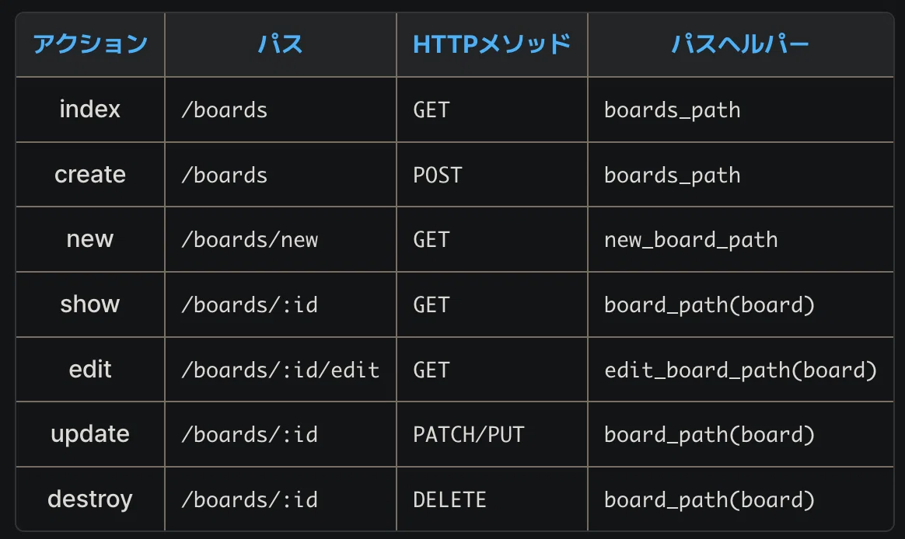

## render
### 基本
部分テンプレート（パーシャル）は、コードを整理して再利用しやすくするための仕組み。

### どうなるか
- `_search_form.html.erb` で部品を作成
- `<%= render 'search_form', q: @q, url: boards_path %>` で呼び出す
- データを渡すことができる（ `q: @q` など）

### コード例
\`\`\`erb
<%= render 'search_form', q: @q, url: boards_path %>
\`\`\`

### メモ
- ファイル名の先頭に `_` をつける
- 部品を作っただけでは表示されない

## render の status オプション
### 基本
render メソッドでビューを表示する際に、HTTP ステータスコードを指定できるオプションです。

### どうなるか
**デフォルト（status 指定なし）：**
- HTTP ステータスコード 200（OK）が返される
- バリデーションエラーがあっても「正常」として扱われる
- ブラウザはリクエストが成功したと判断する

**status: :unprocessable_entity を指定した場合：**
- HTTP ステータスコード 422 が返される
- 「リクエストは受け付けたが、処理できなかった」ことを明示
- ブラウザの戻るボタンでフォーム再送信を防げる
- エラーメッセージが適切に表示される

### なぜこうなるか
**status: :unprocessable_entity が必要な理由：**
- デフォルトでは 200 OK が返されるため、クライアント側はエラーを認識できない
- 適切なステータスコードを返すことで、クライアントに「処理できなかった」ことを伝える
- SEO やブラウザの挙動にも影響する（戻るボタンでの再送信防止など）

**Rails のベストプラクティス：**
- バリデーションエラー時は `status: :unprocessable_entity` を使う
- 作成・更新失敗時に render する場合は必ず指定する

### コード例

**Users コントローラー：**
\`\`\`ruby
def create
  @user = User.new(user_params)
  
  if @user.save
    redirect_to root_path, success: 'ユーザー登録が完了しました'
  else
    flash.now[:danger] = 'ユーザー登録に失敗しました'
    render :new, status: :unprocessable_entity
  end
end

def update
  if @user.update(user_params)
    redirect_to @user, success: '更新しました'
  else
    flash.now[:danger] = '更新に失敗しました'
    render :edit, status: :unprocessable_entity
  end
end
\`\`\`

### よく使う場面
- 新規登録フォームでバリデーションエラーが発生したとき
- 編集フォームで更新に失敗したとき
- API でエラーレスポンスを返すとき

### 関連する内容
- HTTP ステータスコード
- render メソッド
- バリデーション
- flash メッセージ

### メモ
- `status: :unprocessable_entity` は 422 のシンボル表記
- `render :new, status: 422` と書いても同じ意味
- API の場合は `render json: { errors: @user.errors }, status: :unprocessable_entity` のように使う

## RSpec の subject と .
### 基本
`.subject` の `.` は、RSpec で「現在のメソッド名を自動で補完する」という意味です。

### どうなるか
**subject を使わない場合：**
\`\`\`ruby
describe '#reset_password_email' do
  it 'パスワードリセットメールが送信される' do
    expect { user.reset_password_email }.to change { ActionMailer::Base.deliveries.size }.by(1)
  end
end
\`\`\`

**subject を使う場合：**
\`\`\`ruby
describe '#reset_password_email' do
  subject { user.reset_password_email }
  
  it { is_expected.to change { ActionMailer::Base.deliveries.size }.by(1) }
end
\`\`\`

**. を使う場合：**
\`\`\`ruby
describe '#reset_password_email' do
  subject { user.reset_password_email }
  
  it { is_expected.to change { ActionMailer::Base.deliveries.size }.by(1) }
  # または
  it { expect(subject).to change { ActionMailer::Base.deliveries.size }.by(1) }
end
\`\`\`

### なぜこうなるか
**. の意味：**
- `.subject` の `.` は「現在のメソッド名を自動で補完する」という意味
- `describe '#reset_password_email'` の場合、`.subject` は `user.reset_password_email` を指す
- メソッド名を変更しても、テストコードを修正する必要がない

**is_expected の意味：**
- `is_expected` は `expect(subject)` のエイリアス
- より読みやすく、自然な英語に近い書き方

### コード例
**通常の書き方：**
\`\`\`ruby
describe User do
  describe '#reset_password_email' do
    let(:user) { create(:user) }
    
    it 'パスワードリセットメールが送信される' do
      expect { user.reset_password_email }.to change { ActionMailer::Base.deliveries.size }.by(1)
    end
  end
end
\`\`\`

**subject を使った書き方：**
\`\`\`ruby
describe User do
  describe '#reset_password_email' do
    subject { user.reset_password_email }
    let(:user) { create(:user) }
    
    it { is_expected.to change { ActionMailer::Base.deliveries.size }.by(1) }
  end
end
\`\`\`

### よく使う場面
- RSpec でテストを書くとき
- メソッドの戻り値をテストするとき
- DRY（Don't Repeat Yourself）を意識したテストを書くとき

### 関連する内容
- RSpec の subject
- is_expected
- describe と context
- let と let!

### メモ
- `subject` を使うと、テストコードがシンプルになる
- メソッド名を変更しても、テストコードを修正する必要がない
- ただし、複雑なテストでは逆に読みにくくなることもあるので注意

### 基本
Rails の i18n（国際化）では、`attributes` という単語が2つの異なる意味で使われます。

### どうなるか
**1つ目の attributes（モデルごとの属性）：**
- `activerecord.attributes.user.email` のように使う
- 特定のモデル（user、board など）の属性名を指定する
- モデルごとに異なる訳を設定できる

**2つ目の attributes（全モデル共通の属性）：**
- `activerecord.attributes.id` のように使う
- すべてのモデルで共通する属性名を指定する
- id、created_at、updated_at など

### なぜこうなるか
**モデルごとの attributes が必要な理由：**
- 同じカラム名でも、モデルによって意味が異なる場合がある
- 例：User の name は「ユーザー名」、Board の name は「掲示板名」

**全モデル共通の attributes が必要な理由：**
- id、created_at、updated_at などは、すべてのモデルで同じ意味
- 毎回モデルごとに定義するのは冗長なので、共通化する

### コード例
**config/locales/activerecord.ja.yml：**
\`\`\`yaml
ja:
  activerecord:
    models:
      user: ユーザー
      board: 掲示板
    
    # 1つ目の attributes（モデルごと）
    attributes:
      user:
        email: メールアドレス
        password: パスワード
        password_confirmation: パスワード確認
        last_name: 姓
        first_name: 名
      board:
        title: タイトル
        body: 本文
      
      # 2つ目の attributes（全モデル共通）
      id: ID
      created_at: 作成日時
      updated_at: 更新日時
\`\`\`

**使用例（ビュー）：**
\`\`\`erb
<!-- モデルごとの属性 -->
<%= f.label :email %>  <!-- 「メールアドレス」と表示される -->
<%= f.label :password %>  <!-- 「パスワード」と表示される -->

<!-- 全モデル共通の属性 -->
<%= @user.human_attribute_name(:id) %>  <!-- 「ID」と表示される -->
<%= @user.human_attribute_name(:created_at) %>  <!-- 「作成日時」と表示される -->
\`\`\`

### よく使う場面
- フォームのラベルを日本語化するとき
- バリデーションエラーメッセージを日本語化するとき
- モデルの属性名を表示するとき

### 関連する内容
- Rails の i18n（国際化）
- activerecord.ja.yml
- human_attribute_name メソッド
- form_with と label

### メモ
- モデルごとの attributes の方が優先される
- 全モデル共通の attributes は、モデルごとに定義されていない場合に使われる
- カラム名をそのまま表示したくない場合は、必ず設定する

## reset_password_token
### 基本
reset_password_token は、パスワードリセット機能で使用されるトークンです。
ユーザーがパスワードリセットをリクエストしたときだけ、このカラムにトークンが設定されます。

### どうなるか
**通常時：**
- パスワードリセットをリクエストしていないユーザーは、reset_password_token が nil

**パスワードリセット時：**
- パスワードリセットをリクエストしたユーザーだけ、トークンが設定される
- トークンは一意（unique）である必要がある

**バリデーション：**
- `uniqueness: true` ：トークンが重複しないようにする
- `allow_nil: true` ：トークンが nil でもOK（通常時は nil なので）

### なぜこうなるか
**uniqueness: true の理由：**
- トークンが重複すると、別のユーザーのパスワードをリセットできてしまう
- セキュリティのため、トークンは一意である必要がある

**allow_nil: true の理由：**
- 通常時は reset_password_token が nil
- `allow_nil: true` があることで、nil でもバリデーションをスキップできる

**注意点：**
- `presence: true` と `allow_nil: true` を同時に指定すると、nil でもOKだが、空文字列（""）はNG
- ただし、reset_password_token では `presence: true` は不要（通常時は nil だから）

### コード例
**マイグレーションファイル：**
\`\`\`ruby
class SorceryResetPassword < ActiveRecord::Migration[7.0]
  def change
    add_column :users, :reset_password_token, :string, default: nil
    add_column :users, :reset_password_token_expires_at, :datetime, default: nil
    add_column :users, :reset_password_email_sent_at, :datetime, default: nil
    add_column :users, :access_count_to_reset_password_page, :integer, default: 0

    add_index :users, :reset_password_token, unique: true
  end
end
\`\`\`

**Userモデル：**
\`\`\`ruby
class User < ApplicationRecord
  authenticates_with_sorcery!

  validates :reset_password_token, uniqueness: true, allow_nil: true
end
\`\`\`

### メモ
- Sorcery の `reset_password` サブモジュールで使用される
- トークンは自動的に生成される（手動で設定する必要はない）
- トークンには有効期限がある（ `reset_password_token_expires_at` で管理）

# Railsバリデーションまとめ
https://qiita.com/h1kita/items/772b81a1cc066e67930e

ActiveRecord
* モデル同士の関連付け(アソシエーション)を表現する
* 関連付けられているモデル間の継承階層を表現する
* データをデータベースで永続化する前にバリデーション(検証)を行なう
* データベースをオブジェクト指向スタイルで操作する

## RailsのモデルはActiveRecordを継承している
モデルはApplicationRecordを継承し、ApplicationRecordはActiveRecord::Baseを継承。
class ApplicationRecord < ActiveRecord::Base
end

class User < ApplicationRecord
end

## belongs_to関連付け
あるモデルでbelongs_to関連付けを行なうと、宣言を行った側のモデルの各インスタンスは、他方のモデルのインスタンスに文字どおり「従属（belongs to）」となる。

例）Railsアプリケーションに著者（Author）と書籍（Book）の情報が含まれており、
書籍1冊につき正確に1人の著者を割り当てたい場合は、
Bookモデルで以下のように宣言します。
class Book < ApplicationRecord
  belongs_to :author
end

belongs_to関連付けで指定するモデル名は必ず「単数形」にしなければいけない。

## has_many関連付け
has_many関連付けは、has_oneと似ているが、相手のモデルとの「1対多」のつながりを表す点が異なる。
has_many関連付けは、多くの場合belongs_toの反対側で使われる。
has_many関連付けは、そのモデルの各インスタンスが、相手のモデルのインスタンスを0個以上持っていることを示す。

例）さまざまな著者（Author）や書籍（Book）を含むアプリケーションでは、Authorモデルを以下のように宣言できる。
class Author < ApplicationRecord
  has_many :books
end

has_one関連付けやbelongs_to関連付けの場合と異なり、has_many関連付けを宣言する場合は、相手のモデル名を「複数形」で指定する必要がある。

https://railsguides.jp/association_basics.html#%E9%96%A2%E9%80%A3%E4%BB%98%E3%81%91%E3%82%92%E4%BD%BF%E7%94%A8%E3%81%99%E3%82%8B%E7%90%86%E7%94%B1

## dependent: :destroyを追加することで、「親モデルを削除する際に、その親モデルに紐づく「子モデル」も一緒に削除できる」ようになります。

https://qiita.com/Tsh-43879562/items/fbc968453a7063776637

# 基本的な継承の書き方
Rubyでは<演算子を使ってクラスを継承する。

class 子クラス < 親クラス
  子クラスの実装
end

https://qiita.com/5qhj13/items/ef39c689884ce679857b

## モデルの継承
|種類|	例|	説明|
|-------|---|---|
|モデル名|	user|	単数形|
|ファイル名|	user.rb|	単数形|
|モデルクラス名	|User|単数形、頭文字は大文字|
|テーブル名	|users|	複数形

モデル名は__単数形__になる。モデルは「モデルオブジェクトのクラス()」を指す。クラスであり、何かしらの集合体ではないということから単数形になるよう。()前述の例では「一人一人のユーザを表すモデルオブジェクトのクラス」
テーブル名は複数形になる。
・モデルはクラス・テーブルはレコード(user)の集合体

## コントローラーの継承
|種類	|例	|説明|
|-------|---|---|
|コントローラ名|	|users|	複数形|
|ファイル名|users_controller.rb	|複数形|
|コントローラクラス名	|UsersController|	複数形、頭文字は大文字|

コントローラー名は__複数形__になる。コントローラーは「クライアントからのリクエストを受け取り、model/viewと連携してレスポンスを返す役割を担う部分」を指す。前述の例を用いると「User全体(Users)をコントロールするためのもの」だから複数形になる。

## ビューの継承
|種類	|例|	説明|
|-------|---|------|
|フォルダ名	|users|	複数形|

ビューフォルダ名は__複数形__。ビューフォルダは該当のコントローラーと基本対の関係になっているのですが

https://qiita.com/todamasao1/items/ca0bf0c58abce9f936bd

# クラスは「設計図」、オブジェクトは「実際のデータ」
流れ
1. User クラス（設計図）を使う
   ↓
2. User.new でオブジェクト（データ）を作る
   ↓
3. オブジェクトを操作する（保存、更新、削除）

つまり
ApplicationRecord（親クラス）
  ↓ 継承
User クラス（子クラス）
  ↓ new / create / find
user オブジェクト（実際のデータ）

|命名スタイル|	特徴|	構文ルール|	使いどころ|
|----------|-----|------------|--------|
キャメルケース|camelCase|	単語の区切りに記号を使わず、2語目以降の先頭を大文字にする形式。
JavaScriptの標準スタイルで、読みやすさと書きやすさのバランスに優れる。	最初の単語は小文字、2語目以降は大文字。
|userName|getUserData|	JavaScriptの変数名・関数名。|
|スネークケース|snake_case|	単語をアンダースコアで区切る形式。|
可読性が高く、APIやバックエンドとの連携でよく使用される。	すべて小文字＋アンダースコア。|
|user_name|total_count|	APIレスポンス、外部データ構造。|
|ケバブケース|kebab-case|	単語をハイフンでつなぐ形式。|
HTML属性名やCSSクラス名で標準的に使用される。	すべて小文字＋ハイフン。|
|main-container|background-color|	CSSプロパティ名・HTMLクラス名。|
|パスカルケース|PascalCase|	単語のすべての先頭文字を大文字にする形式。|
クラス名やReactコンポーネントで広く使われている。		
https://web-dogear.com/blogs/knowledge-diary/202507142341#:~:text=%E3%82%B1%E3%83%90%E3%83%96%E3%82%B1%E3%83%BC%E3%82%B9-,%E3%82%B1%E3%83%90%E3%83%96%E3%82%B1%E3%83%BC%E3%82%B9%E3%81%AE%E7%89%B9%E5%BE%B4,%E3%81%8C%E3%81%97%E3%82%84%E3%81%99%E3%81%84%E5%BD%A2%E5%BC%8F%E3%81%A7%E3%81%99%E3%80%82

# DBを操作するRailsコマンド

### rails db:create #DB作成
rails db:drop　#DB削除
DBを完全に削除するコマンドがrails db:drop。
つまり、DB内のすべてのテーブルやデータを削除する。

### rails db:seed
初期データやテストデータのことで動作確認用に初めからあって欲しいデータがある。これがseed。初期データをデータベースに挿入するコマンド。

### rails db:reset
DBをリセットして初期状態に戻すコマンド。
DBを一度作り直して、schema.rbに沿ってDBを作り直すコマンド。schema.rb は、migration 実行後に自動的に更新される、データベースの定義が書いてあるファイル。

### rails db:migrate:reset
DBをリセットして、すべてのマイグレーションを最初から実行し直すコマンド
DBの設計書(migrationファイル)に基づいて再作成するので、リセットするときはこちらのコマンドの方がいいらしい。

db:reset < db:migrate:reset
### 両者の違い
* db:reset はマイグレーションファイルを編集しても、その内容は反映されない。スキーマファイル ( db/schema.rb ) だけを利用する。
* db:migrate:reset はマイグレーションファイルを直接利用する。つまり、変更が反映される。

rails db:migrateでマイグレーションすると、db > schema.rbが更新される。
このファイルの役割は何かについて
マイグレーションの状況を確認する schema.rbの中にはマイグレーションをいつ実施し、どんなテーブルを作成したかの情報が入っている

DBを操作するRailsコマンド集(最低限知っておくべき‼︎)
https://zenn.dev/norihashimo/articles/2ae00505007f80

# ルーティングのネスト
ルーティングのネストとは、
あるコントローラへのルーティングの記述の中に、
別のコントローラへのルーティングを記述すること。

例)
Twitterの場合、
ツイートに対してコメントできる機能があるその場合、
このアプリケーションのルーティング（routes.rb）の記述は以下のようになる。
Rails.application.routes.draw do
  resources :tweets do
    resources :comments, only: [:create]
  end
end
tweetsコントローラへのルーティングの記述の中に、
commentsコントローラへの記述が書かれている。
こうすることによって、どのツイートに紐づいたコメントなのかをURLで判別できるようにしている。

## メリット
①URLの階層構造ができる先程のTwitterのルーティング記述により生成されるURLは、
「/tweets/id/comments」になる。
もっと具体的に言うと、
とあるツイートにコメントすると
「/tweets/2/comments」のようなURLが生成される。
この「2」という数字はツイートのid番号。
つまり、このコメントは2番のツイートに対するコメントということが、URLから判断することができる。

②関係性のあるもの同士を紐づけることができる
関係があるもの同士は、原則ルーティングをネストさせて関係性のあるURLを生成.使用する考え方・利用法としては、
特に親子関係をもつテーブルがあり、それぞれ親に紐づくデータのみを扱いたいときにネストすることが多い。

Rails】ルーティングのネストについて
https://qiita.com/mmaumtjgj/items/6ffc0f5cc850ab42d3cb#:~:text=%E3%83%AB%E3%83%BC%E3%83%86%E3%82%A3%E3%83%B3%E3%82%B0%E3%81%AE%E3%83%8D%E3%82%B9%E3%83%88%E3%81%A8%E3%81%AF%E3%80%81%E3%81%82%E3%82%8B%E3%82%B3%E3%83%B3%E3%83%88%E3%83%AD%E3%83%BC%E3%83%A9%E3%81%B8%E3%81%AE%E3%83%AB%E3%83%BC%E3%83%86%E3%82%A3%E3%83%B3%E3%82%B0,Copied!&text=tweets%E3%82%B3%E3%83%B3%E3%83%88%E3%83%AD%E3%83%BC%E3%83%A9%E3%81%B8%E3%81%AE%E3%83%AB%E3%83%BC%E3%83%86%E3%82%A3%E3%83%B3%E3%82%B0,%E3%81%A7%E3%81%8D%E3%82%8B%E3%82%88%E3%81%86%E3%81%AB%E3%81%97%E3%81%A6%E3%81%84%E3%82%8B%E3%80%82

postモデルとcommentモデルが1対多数の関係にあり、
わかりやすくするためにルーティングをネストする場合。
  resources :board, only: %i[index new create show] do
    resources :comments, only: %i[create], shallow: true
  end

board_comments_path  　POST /boards/:board_id/comments(.:format)    comments#create
boards_path 　           GET   /boards(.:format)   　　　　　　　　　　　　boards#index　          POST /boards(.:format)   　　　　　　　　　　　　boards#create
new_board_path  　  GET   /boards/new(.:format)                   boards#new
board_path                 GET   /boards/:id(.:format)                   
boards#show

boardの方は普通のresourcesのときと同じです。
commentの方は、shallowオプションによって少し簡略化されている。

/boards/:board_id/comments/:id
↓
/boards/:board_id/comments

##shallowオプションを指定すると、
index,new,createなどのidを持たないアクション（コレクション）の場合は、idが省略される。
反対に、show,edit,update,destroyのようなidが必要なアクション（メンバー）の場合は、ネストに含まれないようになる。

【rails】ルーティングをネストしてshallowオプションをつける
https://study-output.hatenadiary.com/entry/2021/04/30/203733

* Rails の finder 系メソッドをちゃんと理解するhttps://qiita.com/htz/items/da416140a9913fab3fc7

Railsの用語まとめ
https://zenn.dev/kaishigaki/scraps/ff120fc7c81bfb

# バリデーション
バリデーションの目的は、
有効なデータだけをデータベースに保存し、
無効なデータがデータベースに紛れ込まないようにすること。 
Railsではバリデーションを簡単に利用できるよう、
一般に利用可能なバリデーションヘルパーが組み込まれており、
独自のバリデーションメソッドも作成できるようになっている。
https://railsguides.jp/active_record_validations.html

# ログレベルとは？
ログレベルとは、プログラムから出力されるメッセージをその重要度に応じて分類したものです。

## 各ログレベルの解説と使用場面
① DEBUG（デバッグ用）
* 用途：細かい動作や状態を確認するための情報を表示。
* 使用例：関数内の変数の値や処理過程など、細かな挙動の確認。
logger.debug("ユーザーIDは {} です".format(user_id))

② INFO（一般情報）
* 用途：プログラムの動作状況や主要な処理の開始・終了を伝える。
* 使用例：処理の開始通知、学習の進捗、正常終了など。
logger.info("データベースへの接続を開始しました")

③ WARNING（警告）
* 用途：想定外の状態だが、処理を続けることができるような問題を記録。
* 使用例：設定ファイルが存在しない場合のデフォルト値使用、APIのレスポンス遅延など。
logger.warning("設定ファイルが見つかりません。デフォルト値を使用します")

④ ERROR（エラー）
* 用途：処理中にエラーが発生したが、プログラム全体が完全に停止しない場合。
* 使用例：ファイルへの書き込み失敗、一部のデータ取得に失敗した場合など。
logger.error("データベースへの書き込みに失敗しました")

⑤ CRITICAL（致命的エラー）
* 用途：重大な問題が発生し、プログラム全体が続行不可能な状態。
* 使用例：データベースへの接続に失敗し、システム全体が動作できないなど。
logger.critical("データベースに接続できません。システムを終了します")

## 各ログレベルの使用例まとめ
|ログレベル|	意味|	代表的な使用場面|
|---------|-------|----------------|
|DEBUG	|細かな動作確認|	変数値の追跡、詳細な処理過程|
|INFO	|動作の一般通知|	開始・終了通知、通常処理|
|WARNING|	潜在的問題|	想定外の挙動だが続行可能|
|ERROR|	明確な問題|	一部の処理失敗、例外処理|
|CRITICAL|	致命的問題|	プログラムの継続不能|

Pythonのログレベル（DEBUG、INFO、WARNING、ERROR、CRITICAL）の違いを詳しく解説
https://zenn.dev/nakano_teppei/articles/d5272cfbkano_teppei/articles/d5272cfb193830193830

ActiveRecord::Relationのオブジェクトに対してメソッドを追加したい時
https://qiita.com/Naggi-Goishi/items/fa756eb3814847fdd05b

# Active Storage の全体像
Active Storage が提供する機能
1. ファイルのアップロード
ユーザーが選んだファイル
  ↓
Active Storage が受け取る
  ↓
設定した保存先に保存
（ローカル or クラウド）
2. ファイルをモデルに紐付け
# モデルに has_one_attached を書くだけ
class Article < ApplicationRecord
  has_one_attached :eye_catch
end

# これで使えるようになる
article.eye_catch.attach(params[:eye_catch])  # 紐付け
article.eye_catch.url                         # URL取得
article.eye_catch.attached?                   # 確認
article.eye_catch.purge                       # 削除
3. 保存先の切り替え
開発環境 → ローカルディスク
本番環境 → Amazon S3 などのクラウド

※ コードを変えずに設定だけで切り替え可能
4. 画像の加工
# リサイズ、トリミング、フォーマット変換など
image.variant(resize_to_limit: [800, 600])

##意味
Active Storageは、Amazon S3やGoogle Cloudなどのクラウドストレージサービスへのファイルのアップロードや、ファイルをActive Recordオブジェクトにアタッチする機能を提供する
分解すると：
「クラウドストレージサービスへのファイルのアップロード」
* 画像やファイルを Amazon S3 などに保存 できる
* 本番環境で使うと便利
「ファイルをActive Recordオブジェクトにアタッチする」
* Article や User などのモデルに 画像を紐付ける ことができる
* has_one_attached や has_many_attached を使う
「機能を提供します」
* これらを 簡単に実現できる仕組み を Rails が用意してくれている
* 複雑なコードを書かなくても使える

＃ layoutメソッドの使い方と使い所とは？
| 項目 | layout 'admin' | layout false |
|------|------------------|----------------|
| レイアウト | 管理画面用のレイアウトが適用される | レイアウトなし（自分で HTML 構造を記述） |
| 表示内容 | サイドバー、ヘッダー、フッターなどが表示される | 記事の内容だけをシンプルに表示 |
| プレビューとしての適切さ | ❌ 余計な情報が多すぎる | ✅ 公開ページに近い見た目を確認できる |

1. layout false から render layout: false に変更
    * クラスレベルで layout false を指定すると、すべてのアクションでレイアウトが無効になります
    * render layout: false はアクションレベルでの指定なので、show アクションのみレイアウトを無効にできます
class Admin::Articles::PreviewsController < ApplicationController
  skip_before_action :require_login

  before_action :preview!

  def show
    @article = Article.find_by!(uuid: params[:article_uuid])
    @article.body = @article.build_body(self)
    render layout: false  # ← この行を追加
  end
end

【Rails】 layoutメソッドの使い方と使い所とは？
https://pikawaka.com/rails/layout

# ヘルパーメソッドを使う理由
| 理由 | 説明 |
|---|---|
| シンプル | たった1行でパンくずリストが表示される |
| 再利用性が高い | 同じヘルパーをすべてのページで使える |
| メンテナンスしやすい | 設定ファイルを修正するだけで、すべてのページのパンくずが変更される |
| HTMLの構造を気にしなくて良い | ヘルパーが自動的にHTMLを生成してくれる |

## render
### 基本
部分テンプレート（パーシャル）は、コードを整理して再利用しやすくするための仕組み。

### どうなるか
- `_search_form.html.erb` で部品を作成
- `<%= render 'search_form', q: @q, url: boards_path %>` で呼び出す
- データを渡すことができる（ `q: @q` など）

### コード例
\`\`\`erb
<%= render 'search_form', q: @q, url: boards_path %>
\`\`\`

### メモ
- ファイル名の先頭に `_` をつける
- 部品を作っただけでは表示されない

# ヘルパーメソッドを使う理由
| 理由 | 説明 |
|---|---|
| シンプル | たった1行でパンくずリストが表示される |
| 再利用性が高い | 同じヘルパーをすべてのページで使える |
| メンテナンスしやすい | 設定ファイルを修正するだけで、すべてのページのパンくずが変更される |
| HTMLの構造を気にしなくて良い | ヘルパーが自動的にHTMLを生成してくれる |

# 中間テーブルが必要かどうかの判断
中間テーブルが必要な場合(多対多: N:N)
両方向で「複数」がある場合:
1. アンケートとカテゴリ
    * 1つのアンケートが 複数のカテゴリ に属する
    * 1つのカテゴリに 複数のアンケート が属する
    * → 中間テーブル必要!
2. 学生と授業
    * 1人の学生が 複数の授業 を受講
    * 1つの授業に 複数の学生 が参加
    * → 中間テーブル必要!

❌ 中間テーブルが不要な場合(1対多: 1:N)
片方だけ「複数」がある場合:
1. ユーザーとアンケート
    * 1人のユーザーが 複数のアンケート を作成
    * 1つのアンケートは 1人のユーザー のもの
    * → 中間テーブル不要Surveysテーブルに user_id を入れるだけ
2. アンケートと選択肢
    * 1つのアンケートに 複数の選択肢
    * 1つの選択肢は 1つのアンケート のもの
    * → 中間テーブル不要Choicesテーブルに survey_id を入れるだけ

具体例で判断してみよう
例1: 「カテゴリ」
質問に答えてみる:
* それ自体が1つの存在として成り立つか？ → YES（「スポーツ」「音楽」など独立して存在）
* 他のテーブルと関連を持つか？ → YES（アンケートと関連を持つ）
* 複数の情報を持つか？ → YES（ID、名前など）
* 複数のレコードが存在しうるか？ → YES（複数のカテゴリがある）
      → テーブル

例2: 「タイトル」
質問に答えてみる:
* それ自体が1つの存在として成り立つか？ → NO（「何の」タイトルか必要）
* 他のテーブルと関連を持つか？ → NO（タイトルは関連を持たない）
* 複数の情報を持つか？ → NO（タイトルは1つの文字列）
* 複数のレコードが存在しうるか？ → NO（1つのアンケートに1つのタイトル）
→ カラム

##  三項演算子
### 基本
条件式をif, elseを使わないで書いてしまえるもの。

### 例
　作っているもの→　"ブログを作成するサイト"　コードを書く場所→ Articleモデル
また”記事(Article)を『下書き(draft)・公開(published)・公開待ち(publish_wait)』としてstateカラムに分類している状態”

加えて、
### publishde?メソッドとして

def publishable?
    Time.current >= published_at
  end

ここに、“公開可能か判断させるメソッド"を作りたいとします。

### if文で書くと
def adjust_state
  self.state = if publishable?
                   :published       #公開
                 else
                   :publish_wait    #公開待ち
                 end
  end

### これを三項演算子で書く
def adjust_state
    self.state = publishable? ? :published : :publish_wait
  end

三項演算子について
https://qiita.com/KentoBF5587/items/1efcc5dce1ca8950f3fc

